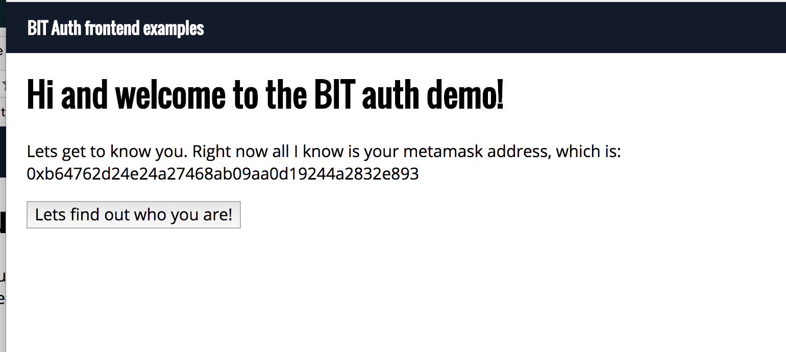
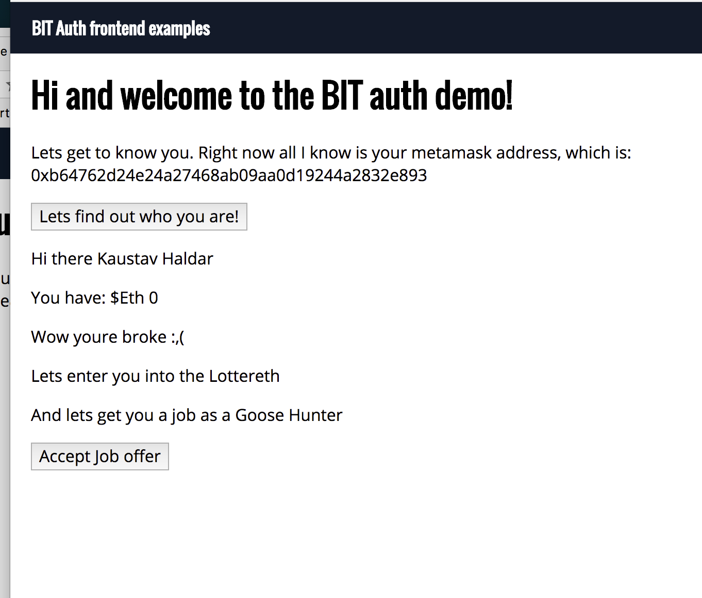
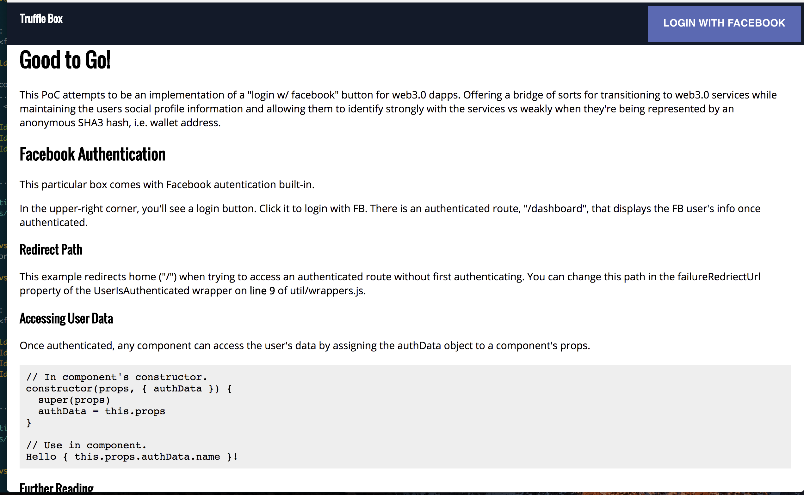
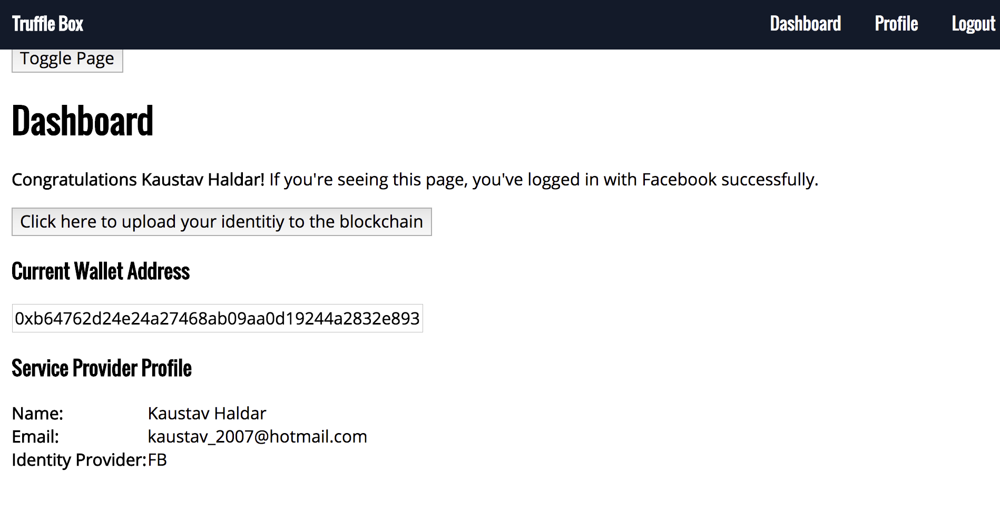
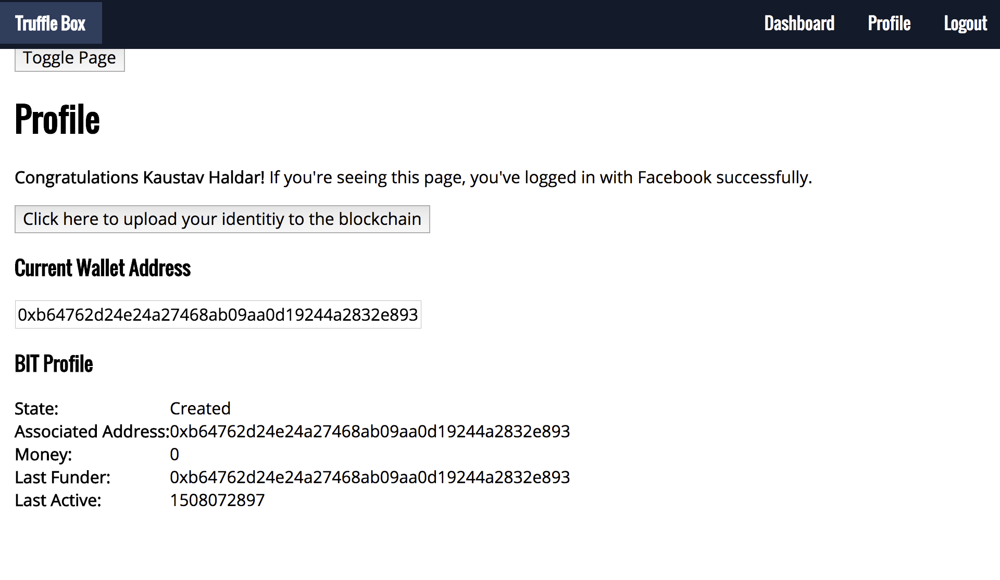

# README - Basic Identity Token

Welcome to the PoC of BIT. 
This PoC attempts to be an implementation of a "login w/ facebook" button for web3.0 dapps. Offering a bridge of sorts for transitioning to web3.0 services while maintaining the users social profile information and allowing them to identify strongly with the services vs weakly when they're being represented by an anonymous SHA3 hash, i.e. wallet address. 

## SETUP
There's 2 projects here.  
IdentityStore provides the identity retrieval, storage abilities
GooseHunter is an implementation of using the IdentityStore dapp and frontend for authentication.  You'll need 3 open terminal windows.  

- First get testrpc running and give yourself some cash money. Replace the account id with your testrpc private key.  
```
 testrpc --account="0x+PrivKey,1000000000000000000"
```
- Get the identity provider running: 
```
cd IdentityStore
npm i
npm run run
```
- Run the GooseHunter auth user app
```
cd GooseHunter
npm i
truffle compile && truffle migrate
npm start
```


## Walkthrough

Authentication flows can be one of 2:
- User starts at GooseHunter app, which attempts to personalize its frontend based on social info. If the user does not have an acc they will be re-routed to the IdentityStore app.  
In the IdentityStore app they can "login w/ facebook".
Profile information from FB is written to the blockchain for a nominal fee.   
IdentityStore then reroutes back to GooseHunter which now has profile information and can render it. 
All future profile use is effectively free as its free to read from the blockchain.   
This also provides a proof of identity and proof of login for the user in case its needed.   


- Alternatively, the user can first login @ IdentityStore, and any future use of GooseHunter will be autopopulated as the profile data is looked up by the users SHA3 wallet address hash. 

## Experimental featurettes:
- taxation & identity pruning
- identity pruning
- Staking associated with id's to prevent abusive behaviour


## PICTURES!!

 Secondary Dapp/user
 Authenticated BIT using app
 BIT PoC introscreen
 BIT data display
 BIT data display 2
